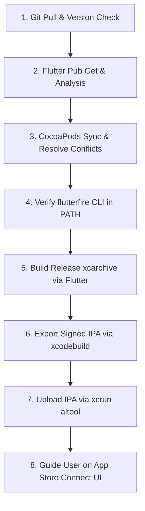

# 🤖 AI Agent Guide: Flutter iOS App Store Release & Automation

This document provides definitive instructions, checklists, and decision trees for AI coding agents tasked with pulling, testing, building, and deploying Flutter iOS applications to Apple App Store Connect via CLI.

---

## 🎯 Primary Directives for AI Agents

1. **Zero Secret Leakage:**
   - **NEVER** output or commit private keys (`.p8`, `.p12`, `.pem`), API key tokens, or raw secrets to git, logs, or user-facing text.
   - Always reference credentials via environment variables (`APPSTORE_KEY_ID`, `APPSTORE_ISSUER_ID`, `APPSTORE_KEY_PATH`) or standard local secure paths (e.g. `~/.private_keys/`).

2. **Always Run Preflight Verification First:**
   - Before attempting an IPA build, ensure dependencies resolve (`flutter pub get`), static analysis is clean (`flutter analyze`), and CocoaPods are installed (`pod install` / `pod update`).

3. **Handle CocoaPods & Flutter Archive Decoupling:**
   - `flutter build ipa --release --export-method app-store` frequently fails during the final export step if the local Mac does not have an Apple ID account actively logged into Xcode GUI.
   - **The Agent Solution:** Let `flutter build ipa` create the release archive (`Runner.xcarchive`), then run `xcodebuild -exportArchive` directly with `-allowProvisioningUpdates` and the App Store Connect API Key flags.

---

## 📋 End-to-End Workflow Checklist



---

## 🛠️ Step-by-Step CLI Playbook

### Step 1: Git Pull & Version Check
```bash
git status
git pull origin main
# Check version in pubspec.yaml (e.g., version: 1.0.9+12)
grep "^version:" pubspec.yaml
```
> [!IMPORTANT]
> Apple App Store Connect strictly rejects any build whose build number (`+build_number`) is equal to or lower than an already uploaded build. Verify that the build number has been bumped.

---

### Step 2: Dependencies & Static Analysis
```bash
flutter pub get
flutter analyze
```
- If static analysis reports issues, fix all syntax/type errors before proceeding.
- Ensure that unit tests that run on desktop host don't block mobile builds if host C++ native assets (like desktop OpenCV) are not configured.

---

### Step 3: CocoaPods & Framework Synchronization
Navigate to the `ios/` folder:
```bash
cd ios
pod install
```
**Common Resolution:** If CocoaPods fails due to Firebase plugin version differences:
```bash
pod update
```
**Framework Collision Resolution:**
If you see duplicate symbol errors for `TensorFlowLiteC.xcframework` (e.g., between `tflite_flutter` and `flutter_litert`), comment out `tflite_flutter` in `pubspec.yaml` and re-run `flutter pub get` and `cd ios && pod install`.

---

### Step 4: Ensure `flutterfire` CLI is Accessible
If the Xcode project contains a build phase for Firebase Crashlytics symbols (`FlutterFire: "flutterfire upload-crashlytics-symbols"`), ensure `flutterfire` is on PATH:
```bash
# Verify presence
which flutterfire || ls -la ~/.pub-cache/bin/flutterfire

# If missing, activate and symlink
dart pub global activate flutterfire_cli
ln -sf "$HOME/.pub-cache/bin/flutterfire" "$FLUTTER_ROOT/bin/flutterfire"
```

---

### Step 5: Build Release Archive
Run Flutter IPA build command from the project root:
```bash
flutter build ipa --release --export-method app-store 2>&1
```
This builds `build/ios/archive/Runner.xcarchive`.
* If Flutter successfully exports the IPA, skip directly to Step 7.
* If Flutter fails at the export step with `error: exportArchive No Accounts` or `error: exportArchive No signing certificate "iOS Distribution" found`, proceed to Step 6.

---

### Step 6: Export Signed IPA via `xcodebuild` with API Key
Execute `xcodebuild -exportArchive` passing the App Store Connect credentials:

```bash
xcodebuild -exportArchive \
  -archivePath "build/ios/archive/Runner.xcarchive" \
  -exportPath "build/ios/ipa" \
  -exportOptionsPlist "ios/ExportOptions.plist" \
  -allowProvisioningUpdates \
  -authenticationKeyPath "$APPSTORE_KEY_PATH" \
  -authenticationKeyID "$APPSTORE_KEY_ID" \
  -authenticationKeyIssuerID "$APPSTORE_ISSUER_ID"
```

#### Minimal `ExportOptions.plist`:
```xml
<?xml version="1.0" encoding="UTF-8"?>
<!DOCTYPE plist PUBLIC "-//Apple//DTD PLIST 1.0//EN" "http://www.apple.com/DTDs/PropertyList-1.0.dtd">
<plist version="1.0">
<dict>
	<key>destination</key>
	<string>export</string>
	<key>generateAppStoreInformation</key>
	<false/>
	<key>manageAppVersionAndBuildNumber</key>
	<true/>
	<key>method</key>
	<string>app-store-connect</string>
	<key>signingStyle</key>
	<string>automatic</string>
	<key>stripSwiftSymbols</key>
	<true/>
	<key>teamID</key>
	<string>YOUR_TEAM_ID</string>
	<key>testFlightInternalTestingOnly</key>
	<false/>
	<key>uploadSymbols</key>
	<true/>
</dict>
</plist>
```

---

### Step 7: Upload IPA to App Store Connect
Upload the generated `.ipa` file using `xcrun altool`:

```bash
xcrun altool --upload-app \
  --type ios \
  -f "build/ios/ipa/<YourApp>.ipa" \
  --apiKey "$APPSTORE_KEY_ID" \
  --apiIssuer "$APPSTORE_ISSUER_ID" \
  2>&1
```

Look for the confirmation:
```
==========================================
UPLOAD SUCCEEDED with no errors
Delivery UUID: <UUID>
==========================================
```

---

### Step 8: User Instructions
Always present the user with:
1. Upload status confirmation (App name, version, build number, file size, Delivery UUID).
2. Clear instructions to open App Store Connect, wait 10–15 minutes for Apple processing, select the new build, fill in release notes, and submit for review.
